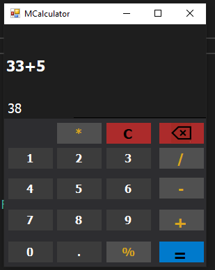

# 🧮 Simple-Calculator (v1.0.0)
«A clean and functional desktop calculator application built with C# and WinForms to master event handling, variable management, and fundamental arithmetic operations.»
---
## 📑 Table of Contents
- [Overview](#overview)
- [Key Features](#key-features)
- [Screenshots](#screenshots)
- [Architecture & Design](#architecture--design)
- [Technologies](#technologies)
- [Acknowledgments](#acknowledgments)
- [License](#license)
- [Author](#author)
---
## Overview
Simple-Calculator (v1.0.0) is a straightforward desktop calculator developed in C# and WinForms. Conceived as a foundational exercise to master event handling and basic computational logic, the application translates mathematical operations into an interactive, user-friendly interface. 
The system focuses heavily on clean variable management, precise arithmetic processing, and maintaining a comfortable, practical layout for everyday calculations.
---
## Key Features
### 🔢 Core Arithmetic
- **Fundamental Operations:** Seamlessly handles basic mathematical calculations including addition, subtraction, multiplication, and division.
### 🎛️ Clean Layout
- **User-Centric Design:** Features an organized and practical interface designed to ensure smooth interactions and straightforward navigation.
### ⚡ Event-Driven Logic
- **Responsive Control:** Implements robust event handling to manage user inputs and dynamic state changes accurately.
---
##  📸 Screenshots

<strong>View Screenshot</strong>

 

### 🧮 Calculator

---

## Architecture & Design
- **Structured Logic:** Designed with clean code organization and modular event routing to efficiently process mathematical inputs and manage calculator states.
---
## Technologies

| Technology | Purpose |
| :--- | :--- |
| **C#** | Core programming language |
| **.NET WinForms** | Desktop UI framework environment |

---
## Acknowledgments
Special thanks to Dr. Mohammed Abu-Hadhoud for simplifying complex concepts and guiding us along this educational path.
---
## License
This project is open-source and available under the **MIT License**. You are free to use, modify, and distribute it in any way you choose, provided that proper copyright and attribution to the original author are maintained.
---
## Author
- **Developer:** Mohammed Abdullah Noman Qaid Mohammed 
